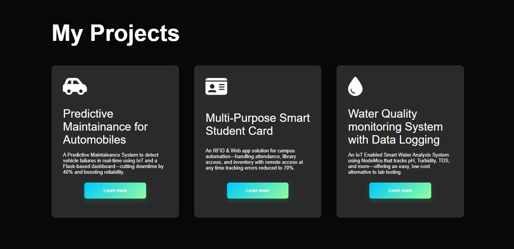

<h1 align="center">💼 Keerthan CK | Portfolio Website</h1>

Welcome to my personal portfolio website — a showcase of my projects, technical skills, and professional experience as an Electronics and Communication Engineer, with a focus on <b>Embedded IoT</b>, <b>Web Development</b>, and <b>Hardware Design</b>.

  🔗 <a href="https://keerthanck.netlify.app" target="_blank"><b>Live Demo</b></a>

---

## 🚀 Features

- 🔧 **Responsive** mobile-first layout  
- 📂 **Project showcase** with animated hover & modal previews  
- 🖼 **Screenshot gallery** powered by gLightbox  
- 📄 **Dedicated** experience and documentation sections  
- 📬 **Contact form** with animated submit button + Google Apps Script integration  
- 🎨 Stylish gradients, button transitions & smooth scroll  
- ✅ **Optimized** for performance & SEO  

---

## 📁 Project Structure
*(Add your folder structure here if you want to show it visually)*

---

## 🛠️ Tech Stack

- 🌐 **HTML5**
- 🎨 **CSS3** (Flexbox, Grid, Animations)
- ⚡ **JavaScript** (Vanilla)
- 📮 **Google Apps Script** (Form submission)
- ✨ **Font Awesome** (Icons)
- 🖼 **gLightbox** (Lightbox gallery viewer)

---

## 📸 Screenshots

  

  

---

## 📬 Contact

- 📧 **Email:** keerthanck705703@gmail.com  
- 🔗 [LinkedIn](https://linkedin.com/in/keerthanckece)  
- 💻 [GitHub](https://github.com/Keerthan-CK/keerthan-ck-portfolio)  

---

## 🔐 License

This project is licensed under the **AIT License**.  
Feel free to fork, use, and modify for personal or professional purposes.

---

## 🙌 Acknowledgements

- 🎥 **Inspiration:** [YouTube Portfolio Tutorials](https://www.youtube.com/watch?v=0YFrGy_mzjY)  
- 🎨 **UI References:** Dribbble, GitHub Pages  
- ✨ **Icons:** [Font Awesome](https://fontawesome.com)  
