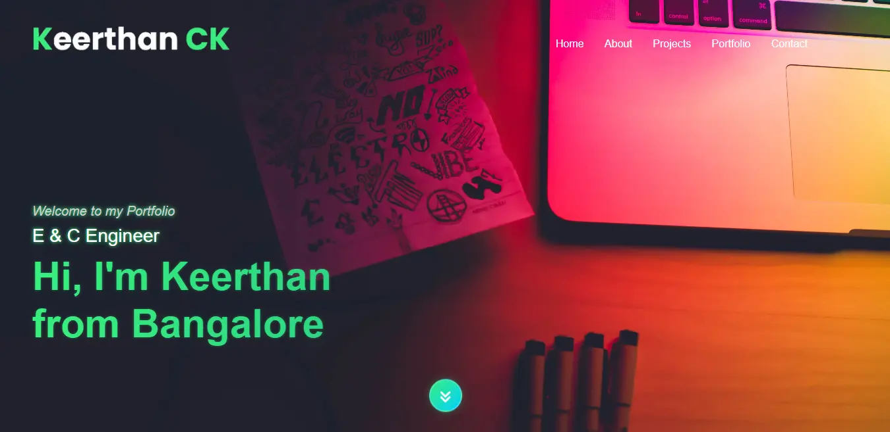
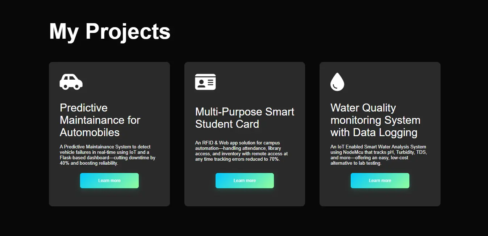

Keerthan CK | Portfolio Website 💼

Welcome to my personal portfolio website built using HTML, CSS, and JavaScript. This website showcases my projects, technical skills, and professional experience as an Electronics and Communication Engineer with a focus on Embedded IoT, Web Development, and Hardware Design.

🔗 Live Demo: [View Portfolio](https://keerthanck.netlify.app)

🚀 Features

 🔧 Responsive, mobilefirst layout
 📂 Project showcase with animated hover and modal previews
 📷 Screenshot gallery using gLightbox
 📄 Dedicated experience and documentation sections
 📬 Contact form with animated submit button and Google Apps Script integration
 🌈 Stylish gradients, button transitions, and smooth scroll behavior
 ✅ Optimized for performance and SEO

📠Project Structure

ğŸ› ï¸ Tech Stack

 HTML5
 CSS3 (Flexbox, Grid, Animations)
 JavaScript (Vanilla)
 Google Apps Script (for form submission)
 Font Awesome (for icons)
 gLightbox (lightbox gallery viewer)

📸 Screenshots

📬 Contact

Feel free to reach out to me via the contact form on the website or:

 📧 Email: keerthanck705703@gmail.com  
 🔗 [LinkedIn](https://linkedin.com/in/keerthanckece)  
 💻 [GitHub](https://github.com/Keerthan-CK/keerthan-ck-portfolio)

🔠License

This project is licensed under the MIT License.  
Feel free to fork, use, and modify it for personal or professional use.

🙌 Acknowledgements

 Inspiration: [YouTube Portfolio Tutorials](https://www.youtube.com/watch?v=0YFrGy_mzjY)
 UI References: Dribbble, GitHub Pages
 Icons: [Font Awesome](https://fontawesome.com)
